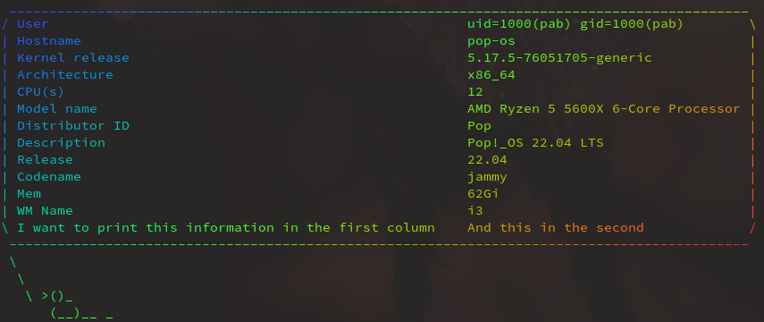
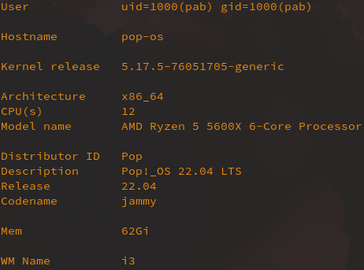
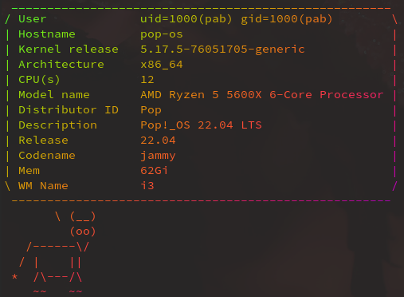
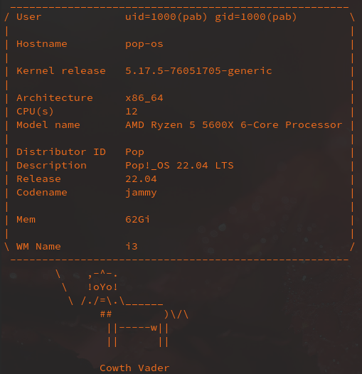

# noneo

`noneo`  is a little program for showing information about your system writen in bash.

The idea of this program comes due to wanting to have an easy way to add things for neofetch to show.

I think the tools that I used to make this are more useful than having neofetch in your machine and maybe you can use the tools for other things.

## Dependencies
If you don't want to install the tools you can run `noneo` without any dependencies.

If you want a fully draw-colored noneo you can install the tools or some of them:

```terminal
sudo apt install cowsay lolcat wmctrl
```

## Run
Clone the repo and make the program executable:

```terminal
cd $PATH_TO_NONEO_REPO
chmod +x noneo
```
Then you can run `./noneo` to print some system information:

```terminal
./noneo
```

```terminal
User             uid=1000(pab) gid=1000(pab)
Hostname         pop-os
Kernel release   5.17.5-76051705-generic
Architecture     x86_64
CPU(s)           12
Model name       AMD Ryzen 5 5600X 6-Core Processor
Distributor ID   Pop
Description      Pop!_OS 22.04 LTS
Release          22.04
Codename         jammy
Mem              62Gi
WM Name          i3
```

### Flags

#### `-h` Print help
```terminal
./noneo -h
```

```terminal

 ███▄    █  ▒█████   ███▄    █ ▓█████  ▒█████
 ██ ▀█   █ ▒██▒  ██▒ ██ ▀█   █ ▓█   ▀ ▒██▒  ██▒
▓██  ▀█ ██▒▒██░  ██▒▓██  ▀█ ██▒▒███   ▒██░  ██▒
▓██▒  ▐▌██▒▒██   ██░▓██▒  ▐▌██▒▒▓█  ▄ ▒██   ██░
▒██░   ▓██░░ ████▓▒░▒██░   ▓██░░▒████▒░ ████▓▒░
░ ▒░   ▒ ▒ ░ ▒░▒░▒░ ░ ▒░   ▒ ▒ ░░ ▒░ ░░ ▒░▒░▒░
░ ░░   ░ ▒ ░ ░ ▒ ▒░ ░ ░░   ░ ▒ ░░ ░  ░  ░ ▒ ▒░
   ░   ░ ░ ░ ░ ░ ▒     ░   ░ ░    ░  ░  ░ ░ ▒
         ░     ░ ░           ░    ░  ░    ░ ░

-c use colors
-s seed for the colors
-m monochromatic
-d draw a 'cow' to say the information
-C use a particular cow (list all cows with `cowsay -l`)
-p blank lines between info functions
-r make all random
-h print this help
```

## Configuration
The default values seek having a good behaviour if no tool is installed (cowsay, lolcat) so they are very basic.

If you want to change some of them you can create a config file in the directory of noneo.

You can create or use the *config.example* file to change the values:

### Example

```terminal
#!/bin/bash

use_cowsay="True"
use_lolcat="True"
pretty="True"
all_random="True"

color_seed="100000"
frequency="0.1"
cow_species="apt"
```

## Adding functions
Adding functions is pretty easy and noneo will show te information that you want.

The program will look for a file called *extra_functions* in the `noneo` script location.

You can create or use the *extra_functions.example* file to add functions there:

There are two requirements:
- The functions needs to print to stdout with the format:
``` terminal
<right column>:<left column>
```

- The function must be in the `extra_functions` array.

### Example

```terminal
cp $PATH_TO_NONEO_REPO/extra_functions.example $PATH_TO_NONEO_REPO/extra_functions
```

Now we can run noneo again, and it will show the information in the example function!:
```terminal
./noneo -r -c -d
```


### Images
```terminal
./noneo -p -c -m -s 10000000
```


```terminal
./noneo -c -d -C apt
```


```terminal
./noneo -c -d -p -m -r
```


## More info
Read about cowsay  for more information about adding you own creatures!
- https://en.wikipedia.org/wiki/Cowsay
